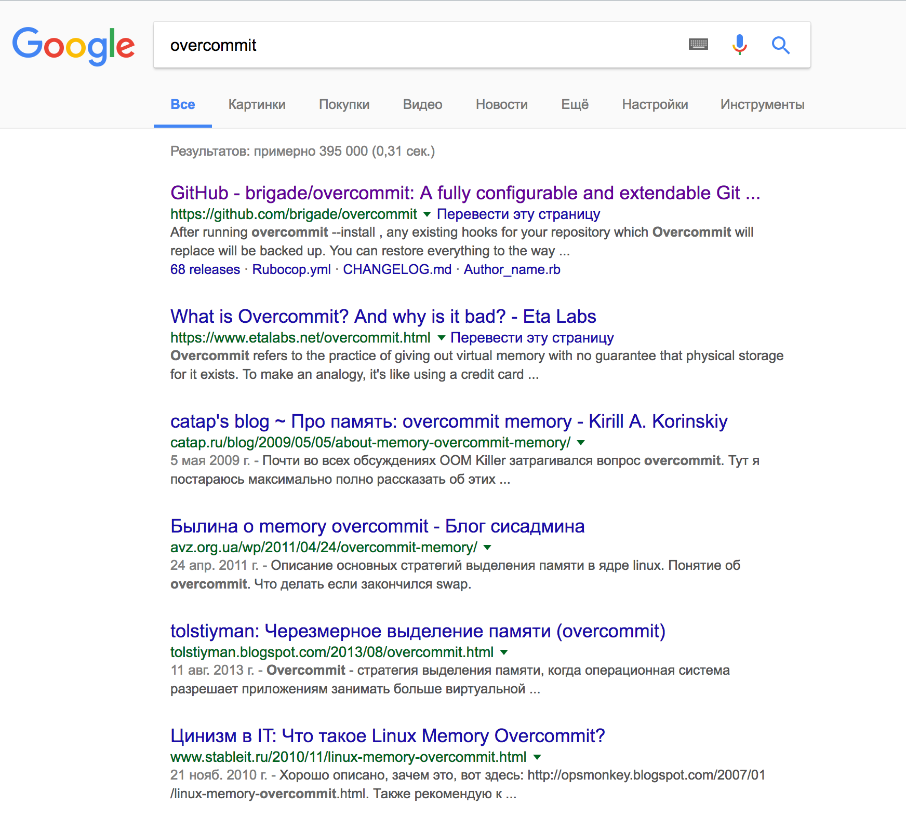
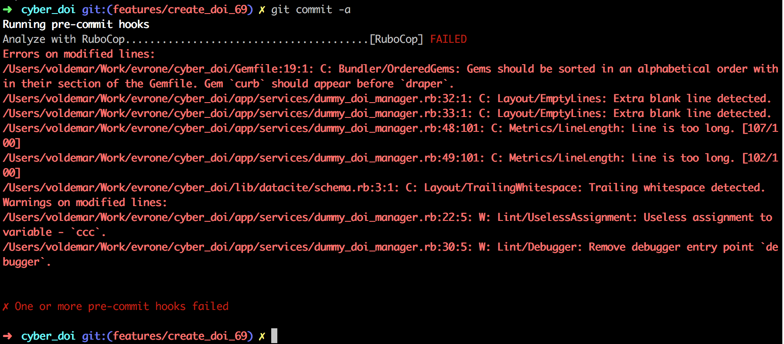

<!-- $size: 16:9 -->

# :facepunch: Overcommit - хуки хуками погоняют

###### Вольдэмар Дулецкий, ruby разработчик, компания Evrone

---
# :skull: Самое важное - самому не пропустить хук*


###### рассуждая про хуки

---


# :muscle: Проект: публикация научных статей

### Команда: 
* #### менеджер проекта
* #### два руби разработчика
* #### фронт-энд разработчик

#### Срок исполнения: два месяца :fire:

---


:scream: Не пытайтесь сами гуглить
===
**название не очень оригинальное*

<center></center>


---

# :fire: Что делает?
### Позволяет просто управлять хуками git


---

# :zap: Хуки 

### PreCommit:
* ### rubocop
* ### haml-lint
* #### scss-lint
### PrePush:
* ### rspec

###### Полный список (около 70 возможных проверок только на PreCommit): https://github.com/brigade/overcommit

---

# :floppy_disk: Конфигурационный файл `.overcommit.yml`

```yaml

PreCommit:
  RuboCop:
    enabled: true
    command: ['bin/bundle', 'exec', 'rubocop', '-R']
    on_warn: fail
  HamlLint:
    enabled: true
    command: ['bin/bundle', 'exec', 'haml-lint', 'app/views/']
    on_warn: fail
  ScssLint:
    enabled: true
    command: ['bin/bundle', 'exec', 'scss-lint']
    include: 'app/assets/**/*.scss'
    on_warn: fail

PrePush:
  RSpec:
    enabled: true
```
---
# :crown: Использование

## Установка:

Gemfile: 

```
gem 'overcommit'
```
Выполняем в консоли:

```bash
bundle exec overcommit --install
```

## Принудительно прогнать хуки:

```bash
bundle exec overcommit -R
```

---

# :metal: Оффлайн


##### все хуки вызываются на машине разработчика
 
---
# :eyes: Как это выглядит?



---

# :cop: Эффективно для микро-комманд до 5 человек

---

# :moneybag: PROFIT

* ### не надо заморачиваться c настройкой CI
* ### код не прошедший проверку не попадает в репозиторий
* ### бесплатно
* ### идеально подходит для самоконтроля

---

# :smiling_imp: Подводные камни
* ### могут возикнуть проблемы с интеграцией в rubymine
* ### синхронизировать настройки линтеров overcommit и сторонних CI
* ### можно принудительно отключить код и отправить непроверенный код

---

# :rocket: В реальной жизни
* **overcommit**: pre-commit hooks - линтеры
* **overcommit**: pre-push hooks - тесты
* vexor.io - тесты в облаке, гоняются на каждый коммит
* codeclimate - еще раз гоняет линтеры на код, помещенный в коммит
* автоматический деплой при слиянии в ветку `develop` через сервис cloud66

---

# :gem: koenig.rb
## Калининградский руби-митап: http://koenig-rb.ru


---

# :clap: Контакты

### Вольдэмар Дулецкий (Voldemar Duletskiy)
### Email: voldemar.duletskiy@gmail.com
### GitHub: github.com/r00takaspin
